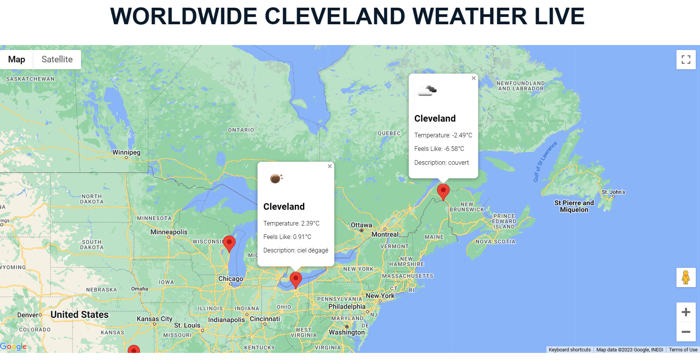

WorldWide Cleveland Weather Live
This project is a simple web application that displays live weather information for the city of Cleveland, Ohio and other nearby cities. The application uses the Google Maps API to display a map of the area, and the OpenWeatherMap API to retrieve live weather data.

How to use
To use the application, simply open the index.html file in your web browser. The map will display the city of Toronto by default, but you can click on the markers to view weather information for other nearby cities, including Cleveland.

APIs used
Google Maps API
OpenWeatherMap API
Technologies used
HTML
CSS
JavaScript
Setup
To run this project locally, you will need to obtain API keys for both the Google Maps API and the OpenWeatherMap API. Once you have your API keys, replace the key placeholder in the index.html and mapView.js files with your actual API keys.

Credits
This project was created by [Your Name]. Feel free to use this project as a starting point for your own weather applications.
